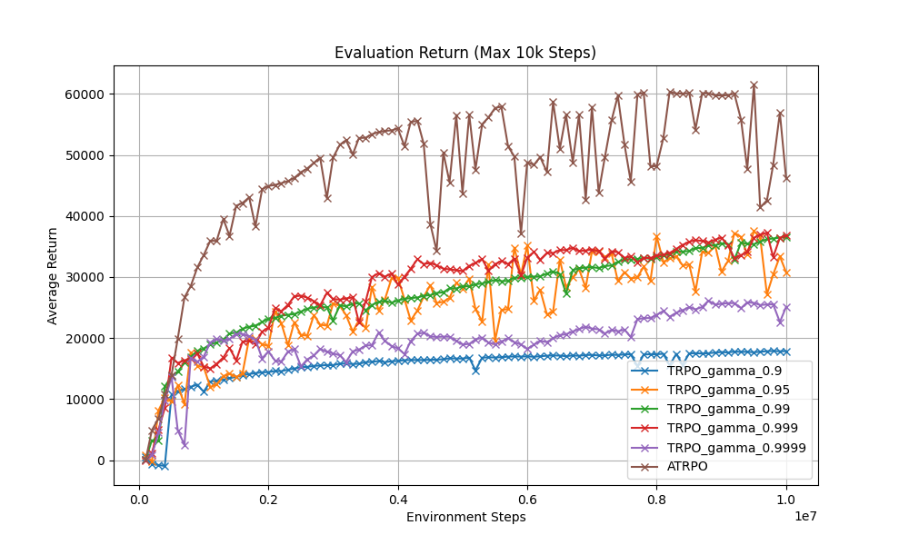
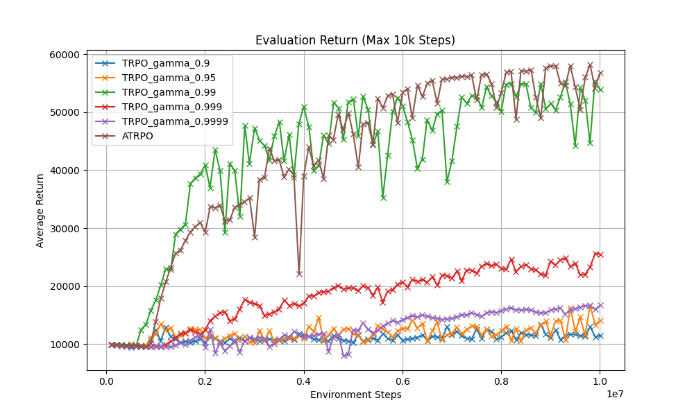
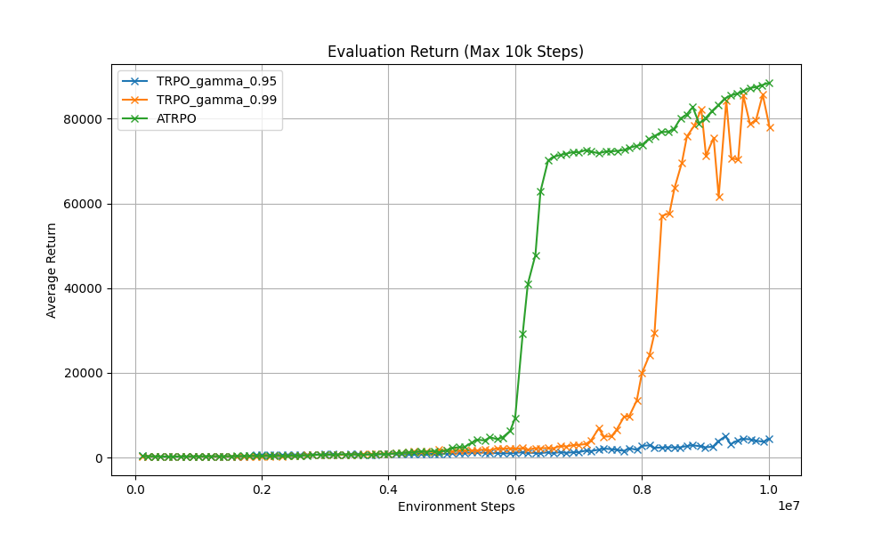

# ATRPO: Average-Reward Trust Region Policy Optimization

A PyTorch implementation of **Average-Reward TRPO (ATRPO)** based on the formulation by **Zhang & Ross (2021)**, compared against standard **Discounted TRPO** on continuous control tasks in Gymnasium MuJoCo.

> **Reference**:  
> Y. Zhang and S. Ross (2021). *"On-Policy Deep Reinforcement Learning for the Average-Reward Criterion"*. [arXiv:2106.07329](https://arxiv.org/abs/2106.07329).

---

## Background & Formulation

Standard on-policy RL algorithms (such as TRPO and PPO) optimize the discounted return objective ($\gamma < 1$). For continuing or long-horizon tasks, discounting introduces optimization bias toward short-term gains.

Following Zhang & Ross (2021), this repository implements on-policy TRPO under the **average-reward criterion**, which eliminates the discount factor from the advantage estimation while centering rewards by the empirical average reward rate:

### 1. Differential TD Error & Advantage Estimation

- **Standard Discounted GAE (TRPO)**:
  $$\delta_t^\gamma = r_t + \gamma V(s_{t+1}) - V(s_t)$$
  $$A_t^{\text{GAE}} = \sum_{l=0}^{\infty} (\gamma \tau)^l \delta_{t+l}^\gamma$$

- **Average-Reward GAE (ATRPO — Zhang & Ross, 2021)**:
  $$\delta_t = (r_t - \bar{r}) + V(s_{t+1}) - V(s_t)$$
  $$A_t^{\text{ATRPO}} = \sum_{l=0}^{\infty} \tau^l \delta_{t+l}$$

  where $\bar{r} = \frac{1}{N} \sum_{i=1}^N r_i$ is the empirical mean reward computed over the sampled batch, and $\tau \in [0, 1)$ controls the bias-variance trade-off.

### 2. Policy Update

The policy parameters $\theta$ are updated using TRPO's trust region constraint:

$$\max_{\theta} \; \mathbb{E}_{s, a \sim \pi_{\theta_{\text{old}}}} \left[ \frac{\pi_\theta(a|s)}{\pi_{\theta_{\text{old}}}(a|s)} A^{\text{ATRPO}}(s, a) \right] \quad \text{s.t.} \quad \mathbb{E}_{s} \left[ D_{\text{KL}}(\pi_{\theta_{\text{old}}}(\cdot|s) \parallel \pi_\theta(\cdot|s)) \right] \le \delta$$

The natural gradient step $F^{-1}g$ is computed with Conjugate Gradient and enforced using a backtracking line search.

---

## Benchmark Results

Training was conducted up to **10,000,000 environment steps** on MuJoCo v5 continuous control benchmarks. Policies were evaluated across 1,000-step (standard) and 10,000-step (extended horizon) rollouts.

### Evaluation Curves (10,000 Steps)

| HalfCheetah-v5 | Ant-v5 |
| :---: | :---: |
|  |  |

| Humanoid-v5 |
| :---: |
|  |

### Final Returns at 10M Steps

| Environment | Eval Horizon | ATRPO (Zhang & Ross) | TRPO ($\gamma=0.999$) | TRPO ($\gamma=0.99$) | TRPO ($\gamma=0.95$) | TRPO ($\gamma=0.9$) |
| :--- | :---: | :---: | :---: | :---: | :---: | :---: |
| **HalfCheetah-v5** | **10,000 steps** | **46,223.5** | 36,843.8 | 36,531.9 | 30,797.8 | 17,858.1 |
| **HalfCheetah-v5** | **1,000 steps** | **5,895.8** | 3,595.8 | 3,585.5 | 3,578.8 | 1,755.8 |
| **Ant-v5** | **10,000 steps** | **56,783.3** | 25,482.4 | 53,874.7 | 14,069.5 | 11,482.7 |
| **Ant-v5** | **1,000 steps** | **5,709.8** | 2,479.5 | 5,449.2 | 3,841.9 | 2,611.7 |
| **Humanoid-v5** | **10,000 steps** | **88,457.8** | — | 77,857.3 | 4,411.8 | — |
| **Humanoid-v5** | **1,000 steps** | **8,525.9** | — | 8,398.2 | 4,405.1 | — |

---

## Code Structure

```plaintext
atrpo/
├── core/
│   ├── trpo.py                 # Conjugate gradient, Fisher-vector products, line search
│   ├── common_new.py           # Average-Reward GAE advantage estimation (Zhang & Ross 2021)
│   ├── common.py               # Standard discounted GAE advantage estimation
│   └── agent.py                # Multi-process trajectory rollout worker
├── models/
│   ├── mlp_policy.py           # Gaussian MLP policy network
│   └── mlp_critic.py           # Value function network
├── utils/
│   ├── math.py                 # Distribution statistics
│   ├── replay_memory.py        # Rollout batch buffers
│   ├── torch_utils.py          # Tensor utilities and flat parameter helpers
│   └── zfilter.py              # Running state normalization
├── assets/
│   ├── learned_models/         # Saved model checkpoints (.p)
│   ├── plots/                  # Generated benchmark plots
│   └── *.csv                   # Evaluation log data
├── Cheetah_simulation.py       # Render and simulate pre-trained models
├── cheetah_allmethods_plots.py # HalfCheetah benchmark comparison script
├── ant_allmethods_plots.py     # Ant benchmark comparison script
├── trpo_cheetah_new_implementation.py # Single experiment training script
└── requirements.txt
```

---

## Installation

```bash
git clone https://github.com/akhilrkurup/atrpo.git
cd atrpo

# Create a virtual environment
python -m venv venv

# Activate virtual environment
# Linux/macOS:
source venv/bin/activate
# Windows:
.\venv\Scripts\activate

# Install dependencies
pip install -r requirements.txt
```

---

## Usage

### 1. Simulate Pre-trained Policies

To view a trained policy in a rendered window:

```bash
# HalfCheetah
python Cheetah_simulation.py --env-name HalfCheetah-v5

# Ant
python Cheetah_simulation.py --env-name Ant-v5

# Humanoid
python Cheetah_simulation.py --env-name Humanoid-v5
```

Optional arguments:
- `--model-path`: Custom path to a saved model `.p` file.
- `--max-steps`: Maximum simulation steps (default: 1000).
- `--delay`: Delay in seconds between rendering frames (default: 0.01).

### 2. Run Benchmark Sweeps

To reproduce the benchmark runs across TRPO ($\gamma \in \{0.9, 0.95, 0.99, 0.999, 0.9999\}$) and ATRPO:

```bash
# HalfCheetah-v5
python cheetah_allmethods_plots.py --max-iter-num 2000 --num-threads 4

# Ant-v5
python ant_allmethods_plots.py --max-iter-num 2000 --num-threads 4
```

### 3. Train a Single Policy

```bash
python trpo_cheetah_new_implementation.py \
    --env-name HalfCheetah-v5 \
    --gamma 0.99 \
    --tau 0.95 \
    --max-kl 0.01 \
    --damping 0.01 \
    --min-batch-size 5000 \
    --max-iter-num 500 \
    --num-threads 4
```

---

## Hyperparameters

| Parameter | Value | Description |
| :--- | :---: | :--- |
| `max_kl` | `0.01` | KL divergence constraint ($\delta$) |
| `damping` | `0.01` | Conjugate gradient damping factor |
| `tau` | `0.95` | GAE parameter ($\tau$) |
| `min_batch_size` | `5000` | Minimum environment steps per policy iteration |
| `l2_reg` | `3e-3` | Value function L2 regularization |
| `log_std` | `-0.5` | Initial log std for Gaussian policy |
| `num_threads` | `4` | Number of worker processes for rollout collection |

---

## References

1. **Zhang, Y., & Ross, S.** (2021). *On-Policy Deep Reinforcement Learning for the Average-Reward Criterion*. arXiv preprint [arXiv:2106.07329](https://arxiv.org/abs/2106.07329).
2. **Schulman, J., Levine, S., Abbeel, P., Jordan, M., & Moritz, P.** (2015). *Trust Region Policy Optimization*. International Conference on Machine Learning (ICML).
3. **Schulman, J., Wolski, P., Dhariwal, P., Radford, A., & Klimov, O.** (2015). *High-Dimensional Continuous Control Using Generalized Advantage Estimation*. International Conference on Learning Representations (ICLR).
4. **Sutton, R. S., & Barto, A. G.** (2018). *Reinforcement Learning: An Introduction* (2nd ed., Chapter 10: On-policy Control with Approximation for Average-Reward MDPs). MIT Press.

---

## License

This project is licensed under the MIT License.
